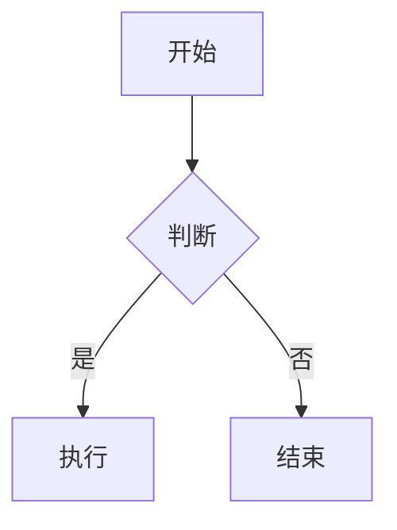

# feishu-markdown

[](https://www.npmjs.com/package/feishu-markdown)
[](https://www.npmjs.com/package/feishu-markdown)
[](https://github.com/huandu/feishu-markdown/actions/workflows/publish.yml)

Markdown 转飞书云文档工具库，支持将 Markdown 文档转换并上传到飞书云文档。

## 特性

- 🚀 **完整的 Markdown 支持** - 标题、段落、列表、代码块、引用、表格、图片等
- 📊 **Mermaid 图表支持** - 自动将 Mermaid 代码块渲染为图片
- 🎨 **富文本格式** - 粗体、斜体、删除线、行内代码、链接等
- 📦 **批量上传** - 优化的批量块创建，支持大型文档
- 🔄 **自动重试** - 内置指数退避重试机制
- 📝 **TypeScript** - 完整的类型定义
- ✅ **双格式输出** - 同时支持 ESM 和 CommonJS

## 安装

```bash
npm install feishu-markdown
# 或
pnpm add feishu-markdown
# 或
yarn add feishu-markdown
```

### Mermaid 支持（可选）

如果需要 Mermaid 图表渲染功能，需要安装 `@mermaid-js/mermaid-cli`：

```bash
npm install -D @mermaid-js/mermaid-cli
```

## 快速开始

```typescript
import { FeishuMarkdown } from 'feishu-markdown';

// 创建实例
const feishu = new FeishuMarkdown({
  appId: 'your-app-id',
  appSecret: 'your-app-secret',
});

// 转换并上传 Markdown
const result = await feishu.convert(
  `
# 我的文档

这是一个段落，包含 **粗体** 和 *斜体* 文字。

## 列表

- 项目 1
- 项目 2
  - 子项目

## 代码

\`\`\`typescript
const greeting = "Hello, Feishu!";
\`\`\`

## 表格

| 名称 | 年龄 |
| --- | --- |
| 张三 | 25 |
| 李四 | 30 |
`,
  {
    title: '我的文档',
    folderToken: 'your-folder-token', // 可选
  }
);

console.log('文档链接:', result.url);
console.log('文档 ID:', result.documentId);
```

## API

### `FeishuMarkdown`

主类，用于创建转换实例。

#### 构造函数

```typescript
new FeishuMarkdown(options: FeishuMarkdownOptions)
```

**参数:**

| 参数        | 类型     | 必填 | 说明                                        |
| ----------- | -------- | ---- | ------------------------------------------- |
| `appId`     | `string` | ✓    | 飞书应用的 App ID                           |
| `appSecret` | `string` | ✓    | 飞书应用的 App Secret                       |
| `baseUrl`   | `string` | -    | API 基础 URL，默认 `https://open.feishu.cn` |
| `timeout`   | `number` | -    | 请求超时时间（毫秒），默认 `30000`          |

#### `convert(markdown, options)`

转换 Markdown 并上传到飞书文档。

```typescript
async convert(markdown: string, options?: ConvertOptions): Promise<ConvertResult>
```

**参数:**

| 参数                     | 类型             | 必填 | 说明                          |
| ------------------------ | ---------------- | ---- | ----------------------------- |
| `markdown`               | `string`         | ✓    | Markdown 内容                 |
| `options.title`          | `string`         | -    | 文档标题                      |
| `options.folderToken`    | `string`         | -    | 目标文件夹 token              |
| `options.batchSize`      | `number`         | -    | 批量创建大小，默认 `50`       |
| `options.mermaid`        | `MermaidOptions` | -    | Mermaid 渲染选项              |
| `options.downloadImages` | `boolean`        | -    | 是否下载外部图片，默认 `true` |
| `options.imageBaseDir`   | `string`         | -    | 本地图片基础目录              |

**返回值:**

```typescript
interface ConvertResult {
  documentId: string; // 文档 ID
  url: string; // 文档 URL
  revisionId: number; // 文档版本 ID
}
```

#### `parse(markdown, options)`

仅解析 Markdown，不上传。用于预览或调试。

```typescript
async parse(markdown: string, options?: ConvertOptions): Promise<{
  blocks: DescendantBlock[];
  rootChildrenIds: string[];
}>
```

### Mermaid 选项

```typescript
interface MermaidOptions {
  enabled?: boolean; // 是否启用，默认 true
  theme?: string; // 主题：default, dark, forest, neutral
  backgroundColor?: string; // 背景色
  width?: number; // 图片宽度
  height?: number; // 图片高度
}
```

## 支持的 Markdown 语法

### 基础语法

| 语法     | 示例                 |
| -------- | -------------------- |
| 标题     | `# H1` ~ `###### H6` |
| 粗体     | `**bold**`           |
| 斜体     | `*italic*`           |
| 删除线   | `~~strikethrough~~`  |
| 行内代码 | `` `code` ``         |
| 链接     | `[text](url)`        |
| 图片     | ``        |

### 块级元素

| 语法     | 说明                        |
| -------- | --------------------------- |
| 段落     | 空行分隔                    |
| 无序列表 | `- item` 或 `* item`        |
| 有序列表 | `1. item`                   |
| 任务列表 | `- [x] done` / `- [ ] todo` |
| 代码块   | ` ``` lang `                |
| 引用     | `> quote`                   |
| 分割线   | `---`                       |
| 表格     | GFM 表格语法                |

### 特殊支持

#### Mermaid 图表

````markdown

````

Mermaid 代码块会自动渲染为 PNG 图片并上传到飞书。

#### 嵌套列表

```markdown
- 第一级
  - 第二级
    - 第三级
```

## 飞书应用配置

1. 在[飞书开放平台](https://open.feishu.cn/)创建应用
2. 获取 App ID 和 App Secret
3. 添加以下权限：
   - `docs:doc` - 文档读写权限
   - `drive:drive` - 云空间读写权限（用于上传图片）
4. 发布应用并获取授权

## 错误处理

```typescript
import {
  ApiError,
  ConfigError,
  FeishuMarkdown,
  TransformError,
} from 'feishu-markdown';

try {
  const result = await feishu.convert(markdown);
} catch (error) {
  if (error instanceof ConfigError) {
    console.error('配置错误:', error.message);
  } else if (error instanceof ApiError) {
    console.error('API 错误:', error.message, error.status, error.code);
  } else if (error instanceof TransformError) {
    console.error('转换错误:', error.message);
  }
}
```

## 导出模块

```typescript
// 主类
export { FeishuMarkdown } from 'feishu-markdown';

// 错误类
export {
  ConfigError,
  ApiError,
  TransformError,
  NetworkError,
  RateLimitError,
  UploadError,
} from 'feishu-markdown';

// 类型
export type {
  FeishuMarkdownOptions,
  ConvertOptions,
  ConvertResult,
  MermaidOptions,
  DescendantBlock,
  BlockType,
  CodeLanguage,
} from 'feishu-markdown';

// 工具函数
export {
  parseMarkdown,
  transformMarkdownToBlocks,
  FeishuClient,
  generateBlockId,
  mapLanguageToFeishu,
} from 'feishu-markdown';

// 构建器
export {
  buildTextBlock,
  buildHeading1Block,
  buildCodeBlock,
  buildBulletBlock,
  buildTableBlock,
  // ... 更多
} from 'feishu-markdown';
```

## 开发

```bash
# 安装依赖
pnpm install

# 运行测试
pnpm test

# 构建
pnpm build

# 代码检查
pnpm lint
```

## 许可证

MIT
